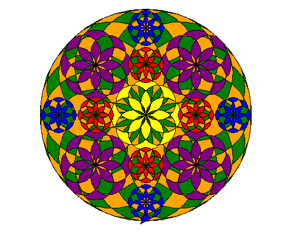

# Pookkalam in Code

Simple python program to draw a pookkalam

## Technologies used

- [Python](https://www.python.org/)

## How to Run

```
python pookkalam.py
```

## Demo

>This demo was captured from my PC(Fedora 26) using open source software [peek](https://github.com/phw/peek).


